
<h1 align="center">基于Java企业项目管理系统</h1>

## 简介
Java企业项目管理系统：角色分为管理员和用户；实现项目管理、用户管理、公告管理、论坛管理等功能，支持项目申报、文档上传、操作日志和多条件筛选，界面设计简洁高效。    --计算机毕业设计源码；毕设源码；java毕业设计源码

## 联系方式

<h3 align="center">获取完整代码与数据库文件 + 微信：deepguan QQ: 86050149 QQ群: 783742310</h3>

<h3 align="center">可帮忙远程部署 包运行成功！提供远程部署、修改代码、设计文档指导、代码讲解等服务！</h3>

## 功能介绍（完整见运行截图）
管理员：基本功能包括登录、登出和系统操作日志管理。管理员可通过导航栏访问论坛管理、用户管理、项目管理、公告管理等模块。系统支持对各类信息的查看、修改和删除。此外，管理员能够管理用户提交的项目申报和公告发布，并对用户申请进行审核。个人中心提供查看和编辑个人信息的功能。

用户：基本功能包括注册、登录和个人中心访问。在个人中心，用户可以查看和修改个人信息。用户可通过导航栏访问论坛、公告和项目模块，能够发帖、查看公告以及参与项目申报。项目管理中支持上传项目图片和文件、编写项目介绍，并提交项目申请。用户可按需浏览、搜索和筛选公告信息，并查看其项目申请的状态和详情。

## 运行截图
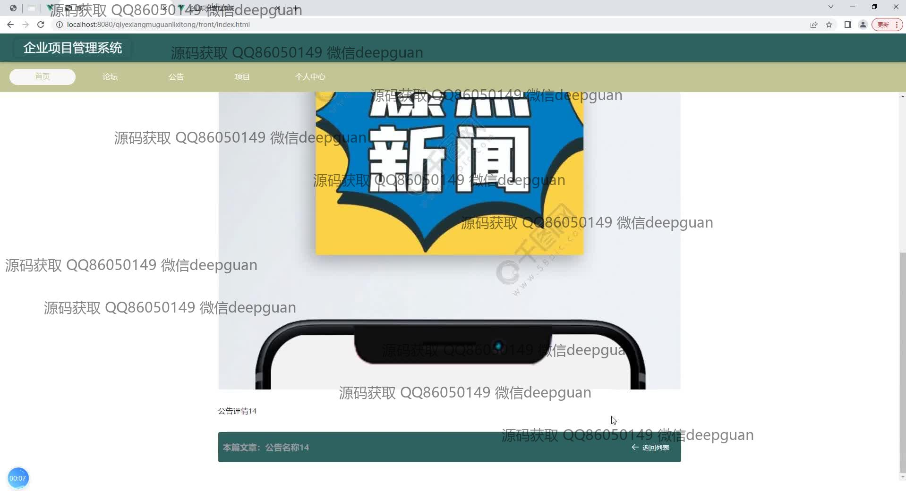
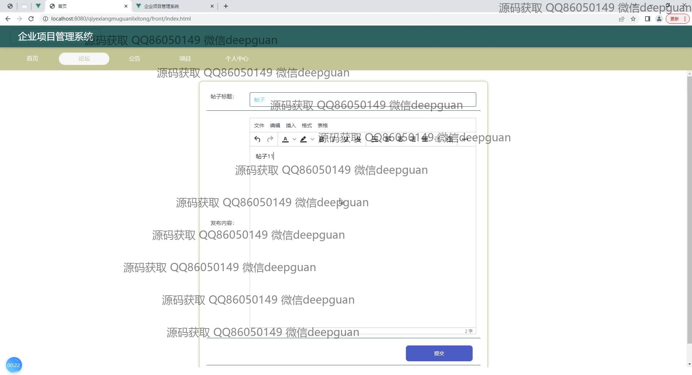
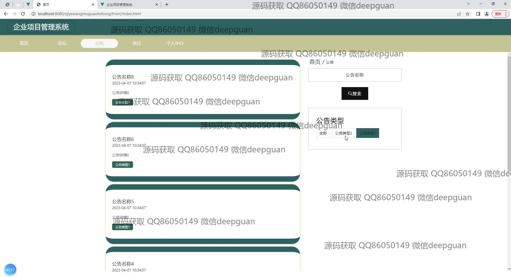
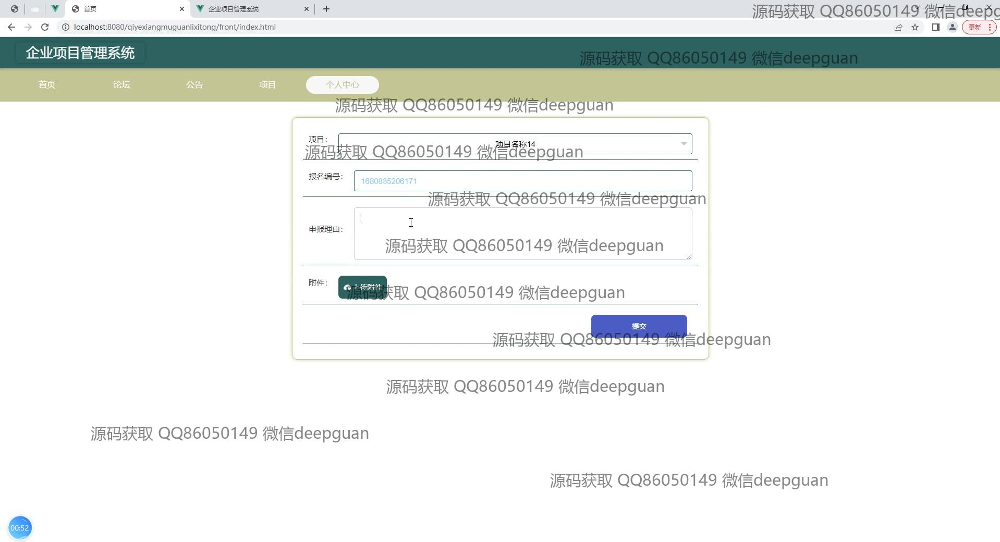
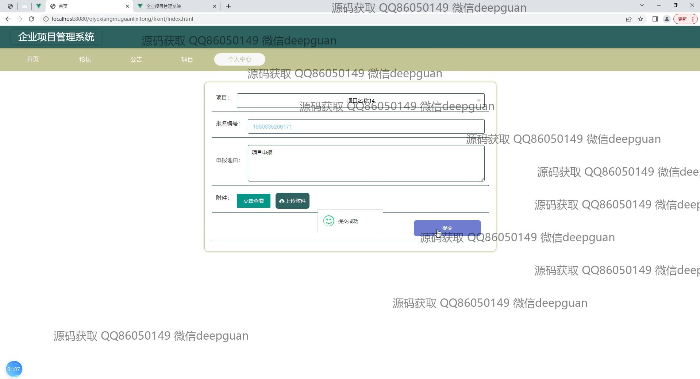
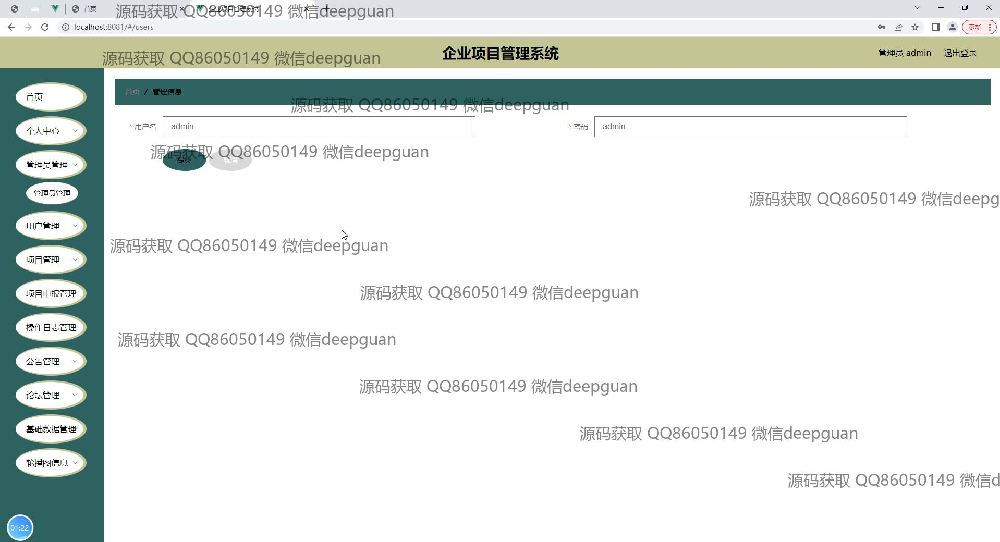
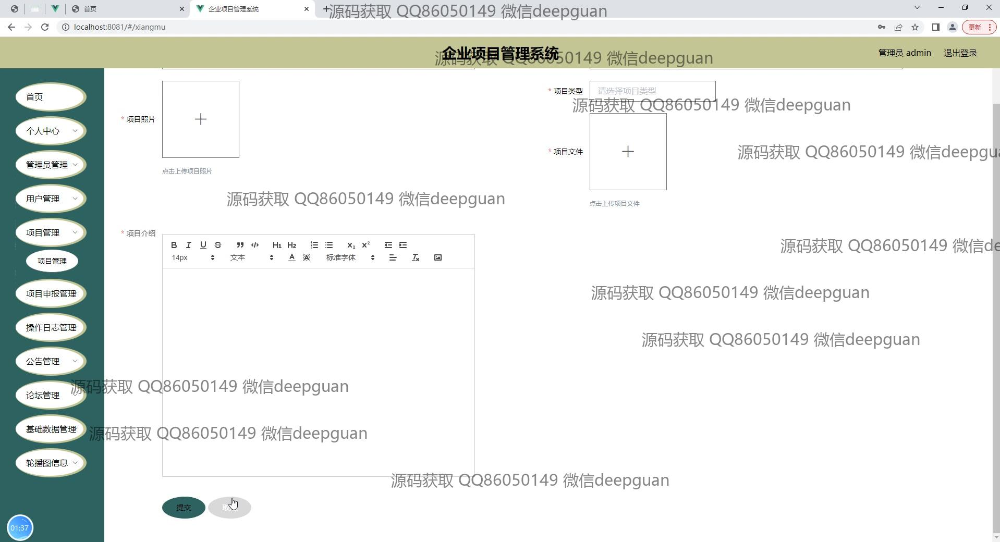
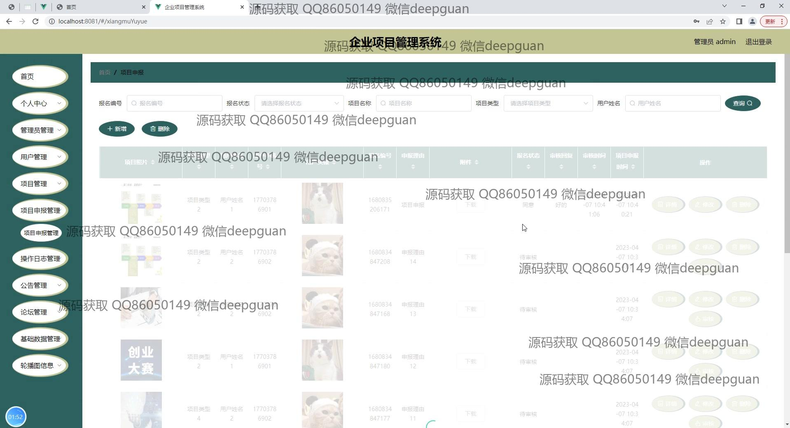
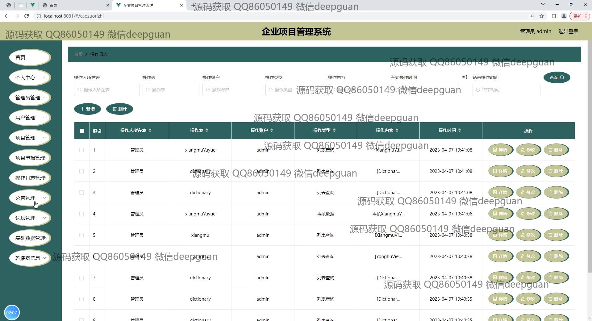
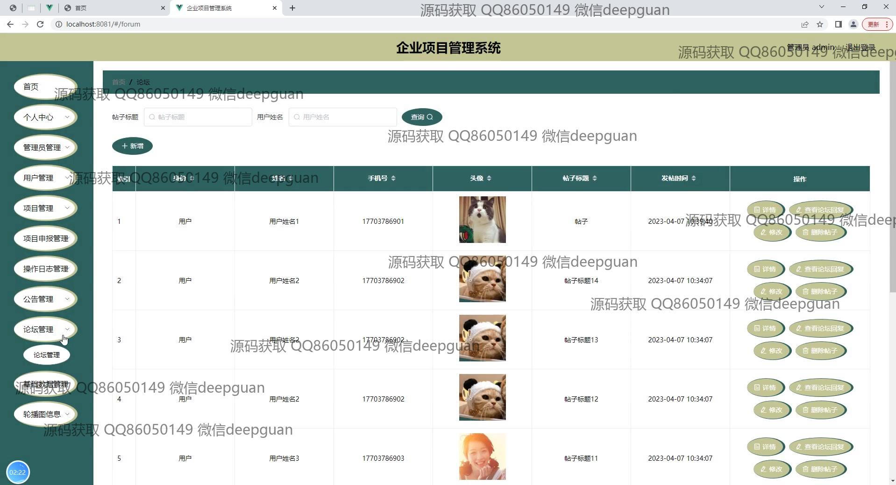
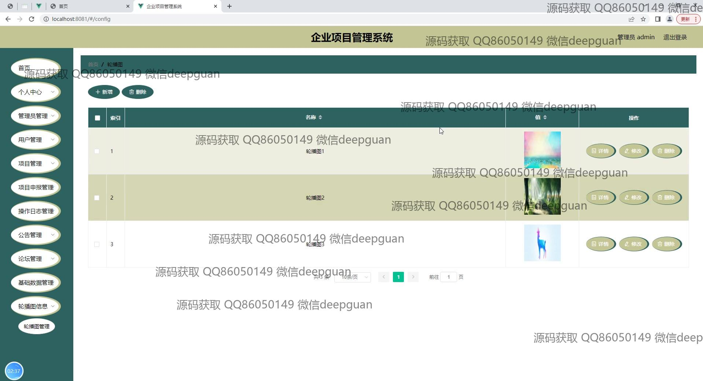

本代码来源于网络,仅供学习参考使用!

